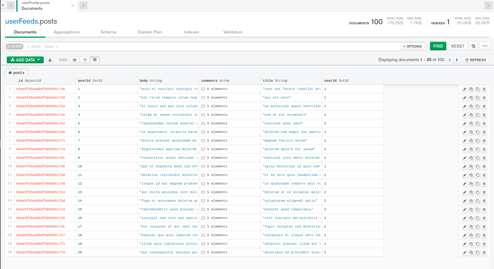
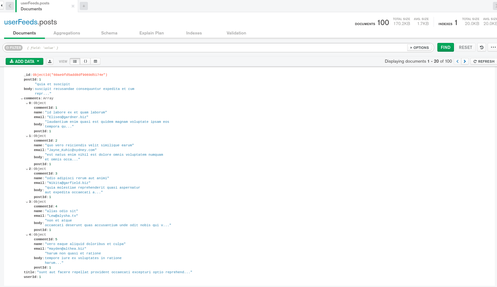
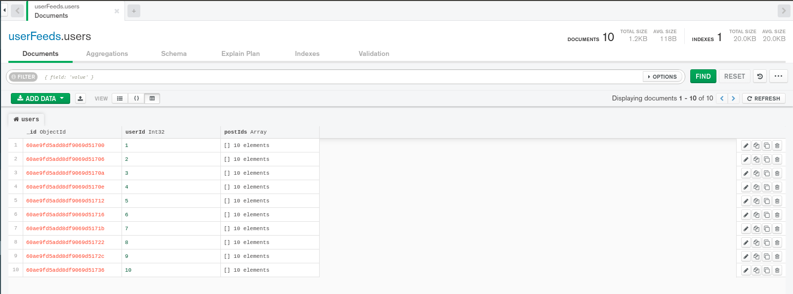
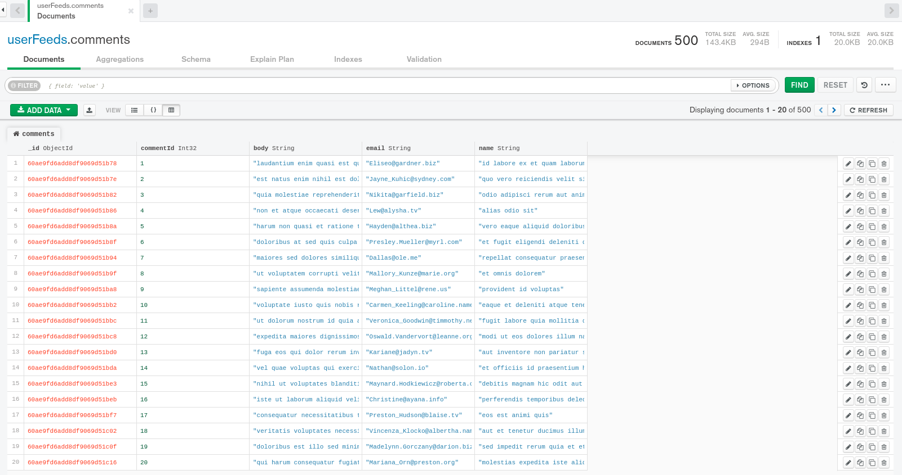
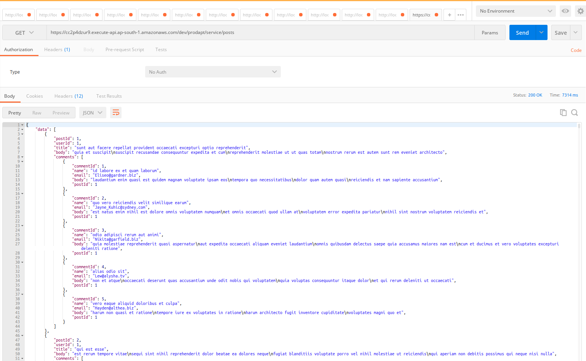
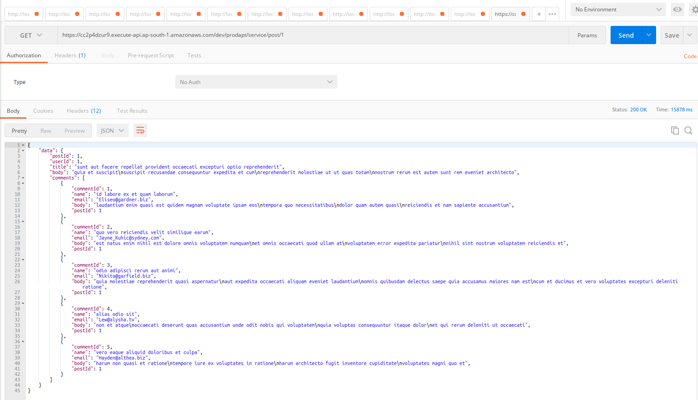
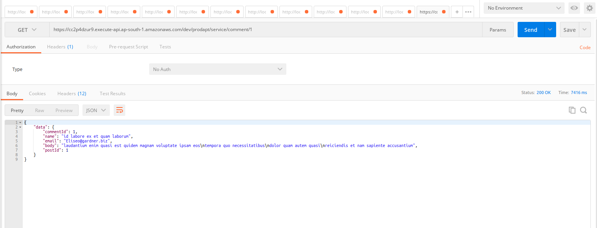

# ProdaptNL Assignment - User Feeds

User Feeds is project where we have two services. One service where users write posts
and other one where users comments on posts. These details can be accessed using the external apis

# External apis:
* https://jsonplaceholder.typicode.com/posts
* https://jsonplaceholder.typicode.com/comments

# Task:

Fetch all the posts and comments, store them, and present them in a **single** structure 

# Tech stacks used:


Languages/Frameworks| Version |
--- | --- | 
Python | 3.8 |
Serverless | 2.43.1
AWS Lambda| Python runtime
MongoDB | 4.4.5

# Solution:

**Storing in a Single Structure**

* Approach Followed:
    * Fetched all details from external apis using Python **requests** module
    * Parsed the response json and stored them in **single structure**- **posts**
    * **posts** is the primary single dictionary where you will the **post details, post id, commments associated with the posts and userid**. 
    * Also storing **users** and **comments** dictionaries for future enhancements
    * For Persistent storage, all these dictionaries are stored in MongoDB under database **userFeeds** as separate collections
  
# MongoDB's collection screenshots

**POSTS**:

<p align="center">
  
</p>

**Single Post data**:

<p align="center">
  
</p>

**Users**:

<p align="center">
  
</p>

**Comments**:

<p align="center">
  
</p>

# APIS to get posts details:

Along with mongo db storage, I have also created the REST GET api using **AWS lambda, API Gateway and serverless framework**

api - https://cc2p4dzur9.execute-api.ap-south-1.amazonaws.com/dev/prodapt/service/posts

** Api will change as there is no concrete domain name for now

Also two more api's also created to get the single post and comment detail by passing their respective ids

GET - https://cc2p4dzur9.execute-api.ap-south-1.amazonaws.com/dev/prodapt/service/post/{post_id}
GET - https://cc2p4dzur9.execute-api.ap-south-1.amazonaws.com/dev/prodapt/service/comment/{comment_id}

POSTMAN screenshot:

POSTS:

<p align="center">
  
</p>

POST by id:

<p align="center">
  
</p>

COMMENT by id:

<p align="center">
  
</p>

#Python code to access the endpoint:
```python
import requests
url = "https://cc2p4dzur9.execute-api.ap-south-1.amazonaws.com/dev/prodapt/service/posts"
headers = {
    'cache-control': "no-cache",
    'postman-token': "30021cd8-9449-7b4e-c630-883c72320aae"
    }
response = requests.request("GET", url, headers=headers)
print(response.text)
```
# Modules explained:

**AbishekKJ/ProdaptNL/prodaptnl.py**:
* Python program which makes requests call to tehe external apis and will collate the data into single dictionary. Running this program standalone will pretty print posts dictionary which consists of all data.

Note:
* MongoDB update call is executed in separate thread using thread pool executor
* Commenting out  ** self.upload_data_to_db()** will skip the mongo db update will ren response much quicker
```python
class ProdaptNLService:

    def __init__(self, posts_data, comments_data):

        self.db_client = None
        self.db = None
        self.posts_data = posts_data
        self.comments_data = comments_data
        self.posts = {}
        self.users = {}
        self.comments = {}
        self.process_data_from_api()
        self.upload_data_to_db()
```


Posts data:
```python
{1: {'body': 'quia et suscipit\n'
             'suscipit recusandae consequuntur expedita et cum\n'
             'reprehenderit molestiae ut ut quas totam\n'
             'nostrum rerum est autem sunt rem eveniet architecto',
     'comments': [{'body': 'laudantium enim quasi est quidem magnam voluptate '
                           'ipsam eos\n'
                           'tempora quo necessitatibus\n'
                           'dolor quam autem quasi\n'
                           'reiciendis et nam sapiente accusantium',
                   'commentId': 1,
                   'email': 'Eliseo@gardner.biz',
                   'name': 'id labore ex et quam laborum',
                   'postId': 1},
                  {'body': 'est natus enim nihil est dolore omnis voluptatem '
                           'numquam\n'
                           'et omnis occaecati quod ullam at\n'
                           'voluptatem error expedita pariatur\n'
                           'nihil sint nostrum voluptatem reiciendis et',
                   'commentId': 2,
                   'email': 'Jayne_Kuhic@sydney.com',
                   'name': 'quo vero reiciendis velit similique earum',
                   'postId': 1},
                  {'body': 'quia molestiae reprehenderit quasi aspernatur\n'
                           'aut expedita occaecati aliquam eveniet laudantium\n'
                           'omnis quibusdam delectus saepe quia accusamus '
                           'maiores nam est\n'
                           'cum et ducimus et vero voluptates excepturi '
                           'deleniti ratione',
                   'commentId': 3,
                   'email': 'Nikita@garfield.biz',
                   'name': 'odio adipisci rerum aut animi',
                   'postId': 1},
                  {'body': 'non et atque\n'
                           'occaecati deserunt quas accusantium unde odit '
                           'nobis qui voluptatem\n'
                           'quia voluptas consequuntur itaque dolor\n'
                           'et qui rerum deleniti ut occaecati',
                   'commentId': 4,
                   'email': 'Lew@alysha.tv',
                   'name': 'alias odio sit',
                   'postId': 1},
                  {'body': 'harum non quasi et ratione\n'
                           'tempore iure ex voluptates in ratione\n'
                           'harum architecto fugit inventore cupiditate\n'
                           'voluptates magni quo et',
                   'commentId': 5,
                   'email': 'Hayden@althea.biz',
                   'name': 'vero eaque aliquid doloribus et culpa',
                   'postId': 1}],
     'postId': 1,
     'title': 'sunt aut facere repellat provident occaecati excepturi optio '
              'reprehenderit',
     'userId': 1}}
```

# Python modules used:

Below are the modules installed in python using pip for the execution,

Modules| Version |
--- | --- | 
certifi | 2020.12.5 |
chardet | 2.1.0
idna Lambda| 2.10
pymongo | 3.11.4
requests | 2.25.1
urllib3 | 1.26.4

# Prerequisite for running serverless:

Please follow below links to set up serverless and aws profile in the local linux machine,

* https://www.serverless.com/framework/docs/providers/aws/guide/installation/
* https://www.serverless.com/framework/docs/providers/aws/guide/credentials/
 

# Why SERVERLESS Framework and AWS Lambda:

**AWS LAMBDA**:

* AWS Lambda creates an instance of the function and runs its handler method to process the event. When the function returns a response, it stays active and waits to process additional events. If you invoke the function again while the first event is being processed, Lambda initializes another instance, and the function processes the two events concurrently. As more events come in, Lambda routes them to available instances and creates new instances as needed. When the number of requests decreases, Lambda stops unused instances to free up scaling capacity for other functions.

* Your functions' concurrency is the number of instances that serve requests at a given time. For an initial burst of traffic, your functions' cumulative concurrency in a Region can reach an initial level of between 500 and 3000, which varies per Region. Note that the burst concurrency quota is not per-function; it applies to all of your functions in the Region.

**Horizontal Scaling**:
* AWS Lambda Platform creates new instances to handle concurrent requests

**Vertical Scaling**:
* AWS Lambda also has a rudimentary vertical scaling option, however, in its memory configuration* Lambda functions can be configured (manually) to have from 128MB to 1.5GB of RAM, and the CPU performance capability of a Lambda function scales ‘roughly proportionally’ with the memory setting.
* In other words you may see a 12X CPU performance improvement going from 128MB to 1.5GB RAM configuration.
* Network I/O ability also scales with RAM.

**Burst concurrency quotas**

* 3000 – US West (Oregon), US East (N. Virginia), Europe (Ireland)
* 1000 – Asia Pacific (Tokyo), Europe (Frankfurt), US East (Ohio)
* 500 – Other Regions

So AWS lambda takes care of serving multiple requests at a time  and also we can use thread pools to multi thread the function calls for better performance

**SERVERLESS**:

* Serverless Framework is an open source project and popular choice for many Amazon Web Services (AWS) customers who wish to quickly construct and deploy serverless applications using services like AWS Lambda and Amazon API Gateway.
* For developers and operations professionals, Serverless Framework builds, packages, and deploys code with one simple command: serverless deploy.
* Serverless Framework is open source software that builds, compiles, and packages code for serverless deployment, and then deploys the package to the cloud.
* With Python on AWS, for example, Serverless Framework creates the self-contained Python environment, including all dependencies. Then, it packages that environment into the standardized zip file for AWS Lambda and creates all of the associated AWS resources required for deployment in an AWS CloudFormation template.
* Finally, it copies the code to AWS and initiates the CloudFormation stack creation or update, which provisions AWS services for the serverless application.
* Serverless Framework does this by providing an event queue into which a combination of standard provided packages and templates can be combined with additional open source plugins to expand the functionality.
* This event queue allows plugin developers to create hooks and alter the behaviors and outputs of each stage of the process (e.g. build, compile, package, provision, and deploy).

